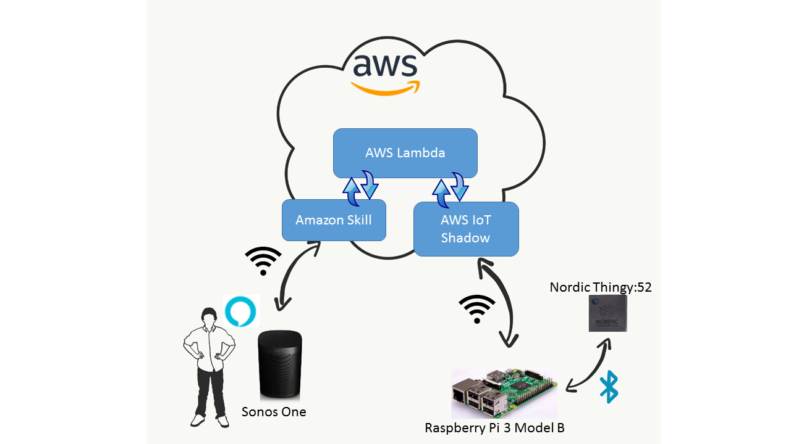

# alexa-nordic-thingy #
Using Amazon Alexa skill to interface Nordic Semiconductor Thingy:52 via a Raspberry Pi.

## Summary
The purpose of this demo is to show how you can use a [Amazon Alexa skill](https://developer.amazon.com/alexa) in order to access and control a [Nordic Thingy:52](https://www.nordicsemi.com/eng/Products/Nordic-Thingy-52).

To accomplish this, I will be using a Raspberry Pi with embedded Bluetooth Low Energy to access data on the Thingy:52. This data is then accessible online from the [Amazon Web Service (AWS)](https://en.wikipedia.org/wiki/Amazon_Web_Services). An Alexa skill is then used to access this web service and thus the data is accessible via the Alexa voice service. An overview of the demo system can be seen below.



```html
THIS REPOSITORY IS WORK IN PROGRESS. 
MORE FEATURES MIGHT BE ADDED AT A LATER TIME.
``` 

## Table of Contents ##
**[Requirements](#requirements)**</br>
**[Step 1: AWS IoT](#step1)**</br>
**[Step 2: Testing AWS IoT Thing CMD Line Access](#step2)**</br>
**[Step 3: Accessing AWS IoT Thing from Python](#step3)**</br>
**[Step 4: Alexa Skill Lambda Interaction](#step4)**</br>
**[Step 5: Lambda Thing Shadow Interaction](#step5)**</br>
**[Step 6: Thingy Raspberry Pi Interaction](#step6)**</br>
**[Step 7: Raspberry Pi Thing Shadow Interaction](#step7)**</br>
**[Step 8: Complete System Test](#step8)**</br>
**[References](#references)**</br>

<a name="requirements"/> <!--- Used in table of contents -->
# Requirements
Items you will need to test this demo. 
-   [Nordic Thingy:52](https://www.nordicsemi.com/eng/Products/Nordic-Thingy-52)
-   [Raspberry Pi 3 Model B](https://www.raspberrypi.org/products/raspberry-pi-3-model-b/) - (probably works with older version as long as you have a BLE USB dongle)
-   Windows Machine - all testing except the last couple of steps were done on Windows
-   Amazon Alexa voice service device – I will be using a [Sonos One](https://www.sonos.com/en-us/shop/one.html) speaker.

<a name="step1"/> <!--- Used in table of contents -->
# Step 1: AWS IoT
This step will describe how to create an AWS IoT Thing along with its certificates for access control.

An AWS IoT Thing is created in order to store the Thingy's sensor data so that it can be accessed from the Alexa voice service. There are several ways of creating an AWS IoT Thing, but I will be using the AWS online console.

## Login/Create account
Go to https://console.aws.amazon.com/iot and if you do not have an account yet, click “Create a new AWS account” and go through the steps to set up an account for yourself. 

There are certain limitations on the AWS Free Tier accounts, please make sure you read these limitations if you intend on using this service in more depth. They will ask your credit card when you create the account, but they will not charge you unless you exceed their free limits. There is a 12 months free trial period, but I have not read upon what that entails. I have not received any charges so far during my testing and the creation of this demo, so if this is all you do, I wouldn't expect any charges to occur.

## Create AWS IoT Thing and its Certificates
Once you have logged into your account you should be on your console [AWS IoT frontpage](https://console.aws.amazon.com/iot/home#/dashboard). There should be a menu on the left.

```html
It is important that you download the private and public keys for the Thing 
at the last step because they will not be accessible later on when that page
is closed! 
Dont worry, if you forget, just delete that Thing, and redo all the steps again
```

- Click on the 'Manage' entry
- Then the 'Things' entry
- There should now be a 'Create' button in the top right, [click it](https://console.aws.amazon.com/iot/home#/create/provisioning) and select 'Create a single thing'
- Set the name of your Thing to be 'NordicThingy'
- You do not need a Thing Type nor do you need a Thing Group
- You can give attributes keys and values to your Thingy, but for now, we can leave that empty
- Click 'Next'
- Click "One-click certificate creation (recommended) – 'Create certificate'"
- Once you click the create certificate button, it will say 'Thing created successfully', and give you the option of downloading four different files
    - Download all four files; 
    - 'A certificate for this thing, xxxx.cert.pem' 
    - 'A public key, xxxx.public.key' 
    - 'A private key, xxxx.private.key'
    - 'A root CA for AWS IoT Download'
        - right click and choose save link as is the easiest way of getting this file. Save it as rootCA.pem
- Once the download of all four files is complete, click the 'Activate' button just beneath the download items
- The button should change to 'Deactivate'
- Click 'Done' 

You should now be back on your AWS dashboard in the Manage Things entry, and your new NordicThingy Thing should be presents in the list of your Things. The following link should be working for you: https://console.aws.amazon.com/iot/home#/thing/NordicThingy.

To make sure the certificate was properly created, click on the 'Secure' entry in the menu, and under [Certificates](https://console.aws.amazon.com/iot/home#/certificatehub), your certificate should be listed.

## Create an access Policy ##
In order to access the IoT Thing, we need to create a Policy that we will attach to the thing. 

- In the 'Secure' entry, click ['Policies'](https://console.aws.amazon.com/iot/home#/policyhub) 
- Click 'Create' in the upper right corner
- Set name of policy to be 'NordicThingyPolicy'
- Under Action type `iot:*`
- Under Resource ARN type `*`
- Check the 'Allow' box under 'Effect'
- Click 'Create'

Your policy should now be listed under Policies, https://console.aws.amazon.com/iot/home#/policyhub, and if you click it, you should see some information about it.

## Link Thing and Policy to the Certificate
In the ['Certificates'](https://console.aws.amazon.com/iot/home#/certificatehub) overview, 

- Click the three dots in the upper right corner of the certificate we just created
- Click 'Attach policy'
- Select the 'NordicThingyPolicy' that we just created 
- Click the three dots again 
- Select 'Attach thing'
- Select the 'NordicThingy' that we created earlier
 
Once this is completed, you should be able to click the 'Certificate' itself on https://console.aws.amazon.com/iot/home#/certificatehub, and under 'Policies' and 'Things' entries on the left, you will see your 'NordicThingyPolicy', and 'NordicThingy'.


<a name="step2"/> <!--- Used in table of contents -->
# Step 2: Testing AWS IoT Thing Access from command line
This part will explain how to test that we can access the AWS IoT Thing we just created from the AWS command line tool. This is to make sure the previous step was done correctly, as well as to get more familiar with the AWS tools that can be used later on during development.

If you have gotten this far without hick-ups, congratulations! I sure did not the first time I tried this. To make sure we are able to access and push data to our AWS Thing, we will be using the AWS Command Line Interface, see https://aws.amazon.com/cli/ for more information on the AWS CLI. Using this tool is not strictly necessary so feel free to skip this part, but I found this to be very useful when implementing the rest of this demo.

```html
Please note if you skip this part, you will have to make sure the Shadow of
your IoT Thing has some data to collect when we move on to the next steps as 
we are going to use this data for testing our other system components. If you 
have time, go through this and make sure it works before moving on.
```

## Installing AWSCLI using PIP
On Windows, install the AWS CLI by calling `pip install awscli` – a prerequisite for this is that pip (from Python) has to be installed and preferably be in your PATH. If it is not, please google how to get that setup properly. 

You can check that AWSCLI got installed properly by calling `aws --version` from the command line. I am using Windows Command Prompt and my version print was `aws-cli/1.14.7 Python/2.7.13 Windows/10 botocore/1.8.11`. 

## Configure awscli
If this is your first time using the awscli, you need to configure it so that you can access your AWS items. 

- Call `aws configure`
- You will be prompted to enter `AWS Access Key ID`,  `AWS Secret Access Key`, `Default region name`, and `Default output format`
- To get your AWS Access Key ID, you should create an [IAM User](https://docs.aws.amazon.com/IAM/latest/UserGuide/id_users_create.html#id_users_create_console) 
    - Sign into https://console.aws.amazon.com/iam/
    - Click on the ['Users'](https://console.aws.amazon.com/iam/home#/users) entry to the left
    - Click 'Add user'
    - Choose a fitting User name, and then set 'Access type' as 'Programmatic access' 
    - I am not that well-rehearsed in these kinds of setup, but on the permissions page, click 'Attach existing policies directly'
    - Then select 'AdministratorAccess' which will provide full access to AWS services and resources for this User 
    - I am sure this is not the way you are supposed to do it, but this should work 
    - Click 'Next: Review', and then click 'Create user' 
    - On this page, you should see your 'Access key ID' as well as a 'Secret access key'. Take note of both of these, as we will use them later on in this demo as well as for the aws configure command. 
- Enter the key ID `****************3IUQ` and secret access key `****************JtTz` you got above into the terminal for the AWS configure
- I chose 'us-east-1' as my region (I have not tested this with any other regions)
- Then set default output format to 'json' 

We should now be ready to test the awscli and access the Thing we just created earlier.

## Testing awscli
### List IoT Things
From the command line, call `aws iot list-things` and you should get a list of all the IoT Things that are registered on your AWS cloud. The Thing we created earlier should be on the list as seen below.
```
C:\Users\Gaute>aws iot list-things
{
    "things": [
        {
            "thingArn": "arn:aws:iot:us-east-1:123456789091:thing/NordicThingy",
            "version": 1,
            "thingName": "NordicThingy",
            "attributes": {}
        }
    ]
}
```

If this does not work, please go through the steps above and check if there is something you might have forgotten to do.

### Update Thing shadow
Later on when Alexa is used to retrieve sensor data from the Thingy, we will be using what is called an [IoT Thing Shadow](https://docs.aws.amazon.com/iot/latest/developerguide/iot-thing-shadows.html). A Thing shadow stores current state information of an IoT thing, so the Thing itself does not have to be online all the time in order for a service to access its data.

To test that we can update the IoT Thing through the CLI, call the following from the command line 
```
aws iot-data update-thing-shadow --thing-name "NordicThingy" --payload "{ \"state\": {\"desired\": { \"ledcolor\": \"red\", \"temperature\": \"25\" } } }" updatethingshadow.txt
```
There should not be any error or warning message return from the command, and there should now be a file called 'updatethingshadow.txt' in the folder you invoked the command from. This file contains the state information that we just pushed to the Thing as well as some metadata. If you now go to the console.aws online, and click on 'Things' under the 'Manage' entry, then click the 'NordicThingy' and select 'Shadow' on the left; you should see the data we just pushed from the command line as well as some date and time information.

Congratulations! We have a working IoT Thing and we are able to push data to its shadow.

```html
If you did not do the steps above, please update the Thing Shadow such that 
it matches the following content:
{
  "desired": {
    "ledcolor": "red",
    "temperature": "25"
  },
  "reported": {
    "ledcolor": "red",
    "temperature": "25"
  }
}
```


<a name="step3"/> <!--- Used in table of contents -->
# Step 3: Accessing AWS IoT Thing from Python
This part will explain how to access the AWS IoT Thing Shadow from Python using the AWS IoT Device SDK for Python, https://github.com/aws/aws-iot-device-sdk-python.

## AWS IoT Device SDK for Python
A Python library for the Raspberry Pi that can be used to access and retrieve sensor data from the Thingy already exists. Therefore, to make our lives easier (and simply because I like programming in Python :D), we will be using Python to access the AWS IoT Thing as well. As mentioned, in order to push and receive data to/from our NordicThingy shadow, we will be using the [AWS IoT device SDK for Python](https://github.com/aws/aws-iot-device-sdk-python). Another possibility would be to use the AWS SDK for javascript.

## Clone AWS SDK Repository and copy certificate files

```html
If you do not want to clone this repository, please make sure you install 
the AWS IoT SDK for Python through 'pip', before you run using the 
attached file of this repository - basicThingyShadowDeltaListener.py.
```

Clone the aws-iot-device-sdk-python to your computer; I am currently using a Windows 10 machine for this

- Enter the folder and copy the certificate files that we downloaded earlier into this folder
- Rename the root CA to 'rootCA.pem'
- Rename the certificate crt to 'certificate.pem.crt'
- Finally rename the private key to 'private.pem.key'

Once these three files are copied, we need to find our custom endpoints to access the IoT Thing. 

- Go to the [console.aws](https://console.aws.amazon.com/console/) online page
- Click on Manage – Things
- Select the [NordicThingy](https://console.aws.amazon.com/iot/home#/thing/NordicThingy)
- On the left, click the 'Interact' entry
- You should see a HTTPS section. Take note of this Rest API Endpoint as it will be used in the following test as well as later on in this demo
    - it should be something similar to `abcd278kjhhhm.iot.us-east-1.amazonaws.com`

## Run example Python application from AWS SDK

```html
I found a slight problem with the ThingShadowEcho.py example from the original
repository and how its debug prints work. I might have been doing something
wrong, but here is how i fixed it; Basically, the prints that are done in 
customShadowCallback_Delta does not seem to be called. So I modified the 
example to use logging.debug(…) instead of the prints statements (moving the 
initialization of the logger module above the class shadowCallbackContainer). 
You might want to do this yourself if you actually want to see when a Delta 
message is received.**
```

From within the same folder where you copied the certificate files, replace `REST_API_ENDPOINT` with your endpoint string in the following command and run it; **Please note that if you are on Linux, the frontslash might have to be replaced with a backslah!**
```
python samples\ThingShadowEcho\ThingShadowEcho.py -e ##REPLACE_THIS_REST_API_ENDPOINT -r rootCA.pem -c certificate.pem.crt -k private.pem.key --thingName "NordicThingy"
```

The console should print a lot of different things. 

- Go on the [IoT console.aws](https://console.aws.amazon.com/iot/)
- Click on the Shadow of the NordicThingy (Manage, click on [NordicThingy](https://console.aws.amazon.com/iot/home#/thing/NordicThingy), Shadow) 
- There is an 'Edit' button above the Shadow Document. Click this edit button
- Change the desired temperature to be `20` instead of `25`
- Click save 

Your command line should print some lines, and if you did the changes as I mentioned above with the logging instead of prints, you should see 'DEBUG – Received a delta message', and what is actually reported. If you refresh your IoT console shadow page, and go into the shadow document again, you should see that is now says desired temperature 20, and reported temperature 20. See screenshot below.
> @@@@ Screenshot to be added @@@@

You can exit the python application with Ctrl + C. 

We now know that we can push and receive data from the AWS IoT Thing shadow using Python – this will also run on the Raspberry Pi when we finally make our Python application that interfaces with the Thingy as well as the IoT Thing Shadow.

## Run example Python application from this repository
I have modified the AWS samples\basicShadow\basicShadowDeltaListener.py example to interact with the Thingy Shadow and included it in this repository, `basicThingyShadowDeltaListener.py` - notice the suddle 'y' in the name of the file :D.

To run this, copy over the same key and crt files as we did to the AWS SDK folder into this repository folder, then call the same command above except replace the path of the file to be the name of my file. Remember to replace the ENDPOINT with your own HTTP string.
```
python basicThingyShadowDeltaListener.py -e ##REPLACE_THIS_REST_API_ENDPOINT -r rootCA.pem -c certificate.pem.crt -k private.pem.key --thingName "NordicThingy"
```

If your Thingy shadow is now including both desired and reported values as it should at this stage, wait a couple of seconds, then the script will push a new temperature value of 15 degrees to the cloud. You should see this in the terminal, and after it it sent, we should also receive a Delta message in the terminal priting the temperature that is desired, vs the one that we just reported. If you look at the shadow document online, you should now see desired, reported, and delta entries in the document. 

If this does not work, try to figure out why before moving on as this script is used as the baseline for the Raspberry Pi script that we are going to run later.


<a name="step4"/> <!--- Used in table of contents -->
# Step 4: Alexa Skill Lambda Interaction
This part will explain how to interact between an Alexa Skill and an AWS Lambda function, https://aws.amazon.com/lambda/. 

We are going to look at how the Alexa voice service can interact with the IoT Shadow in order to eventually retrieve and push data to our Nordic Thingy. The Alexa voice service will interact with the IoT Thing shadow through what's called an AWS Lambda function. The lambda function will get requests from the voice service, and it will then retrieve or send this information to/from the IoT Thing shadow. 

The [AWS Lambda service](https://aws.amazon.com/lambda/) is free as long as we stay below the free limits that are set, https://aws.amazon.com/lambda/pricing/, which should be fine for this demo. You can keep track of your monthly consumption on this page: https://console.aws.amazon.com/billing/home?#/. Throughout this testing and demo writing, I have yet to pass 1% usage on any of the listed items for the AWS services, but I do not take any responsibility if you go above any free limits that are set by AWS - be sure to know what you are doing before you do it.

## Create AWS Lambda function
From https://aws.amazon.com/lambda/

- Click on 'Get Started with AWS Lambda' 
    - It might ask you to sign into the console if you have not already done so
- In the AWS Lambda main overview, click on ['Functions'](https://console.aws.amazon.com/lambda/home#/functions) entry in the menu and you will see a list of any functions you might have created earlier
- Click on 'Create function'
- Select the 'Blueprints' option on the top
- Choose the 'alexa-skill-kit-sdk-factskill'
- Give a name to your function such as 'NordicThingySkill'
- As 'Role*', click 'Create custom role'
    - This will take you to a new webpage
    - Set 'IAM Role' to be `lambda_basic_execution`
    - Set 'Policy Name' to be 'Create a New Role Policy'
    - Click 'Allow' in the bottom right and you will be brought back to the old page again
- Make sure 'Existing Role*' is now `lambda_basic_execution`
- Click 'Create function' 

You should now be brought back to a lambda function overview page.

```html
Please note that if you are not using the blueprint factskill to test the 
included index.js, it might fail because you are missing some of the node.js 
modules that it requires. I suggest starting out with the factskill skill, 
and then simply modify this one to make it work. 
```

## Add Alexa Skills Kit trigger
In order for the Alexa voice service to interact with our AWS Lambda function, we need to connect Alexa Skills kit to the Lambda function. 

- In the Lambda function overview, click on the [NordicThingySkill](https://console.aws.amazon.com/lambda/home#/functions/NordicThingySkill) (unless you are already there)
- Select 'Alexa Skills Kit' from the 'Add triggers' list on the left
- It will say 'Configuration required'
- Click 'Add' at the bottom right
- Click 'Save' in the top right

What we did now was to add the option of triggering the lambda function from the Alexa Skill that we are going to create next. 

Take note of the AWS Lambda ARN that should be displayed at the top of the screen right now. We will be using this ARN when we create our Alexa skill in the next step. The ARN will look something like 
`arn:aws:lambda:us-east-1:12345678909:function:NordicThingySkill`.

## Create Alexa Skill
### Log into Amazon Developer Account
You need to have an Amazon Developer account to do this. 

- Go to https://developer.amazon.com/edw/home.html#/ and either create an account, or log in
- When you have logged in, click on the ALEXA tab at the top, then click 'Get Started >' button under 'Alexa Skills Kit'
- This should take you to https://developer.amazon.com/edw/home.html#/skills, and you should see a list of all the Skills you have developed.

### Add New Skill
#### Skill Information
- Click on 'Add a New Skill' at the top right
- The skill type will be 'Custom Interaction Model'
- I leave language at 'English (U.S.)'
- Name the skill 'NordicThingySkill'
- Invocation Name can be set to what you want to, and will be the name you use to invoke the skill through Alexa. I set that to 'Nordic Thingy'
- You should not have to change anything else, click 'Save' 
- Click 'Next'

#### Interaction Model
You should now be at the Interaction Model entry. The 'Intent Schema' lists all the different 'requests' that we will be making through the voice service, such as Help, Stop, and Cancel. 

- Copy the content of the file [Thingy Intent Schema](ThingyIntentSchema.txt) in this repo into the schema
- Next, the 'Custom Slot Types' will be the 'SENSOR_METRIC' that we are using in the intent schema
- Add the following
```
Enter Type; 
SENSOR_METRIC

Enter Values; 
temperature
color
```

- Click 'Add' 
- Create another Custom Slot Type called 'LIST_OF_COLORS' as shown here
```
Enter Type; 
LIST_OF_COLORS

Enter Values; 
green
red
blue
```

You should now see a custom slot type called SENSOR_METRIC with the values 'temperature | color', as well as the LIST_OF_COLORS.

For 'Sample Utterances' we are going to add the different phrases that we think people will use when interacting with our skill. For now, just add the following lines:
```
WhatsMyMetricIntent {metric}
WhatsMyMetricIntent {metric} please
WhatsMyMetricIntent what's the {metric}
SetIntent set LED color to {Color}
AMAZON.StopIntent thank you
AMAZON.StopIntent exit
AMAZON.StopIntent quit
```
Click 'Save' and then 'Next'. Please note that when you are making an actual Alexa Skill, this list should be more/better populated than it is right now.

#### Configuration
In the 'Configuration' entry, we will set up the skill to access the AWS Lambda function we created earlier. 

- Set 'Service Endpoint Type' to be 'AWS Lambda ARN'
- Enter the Lambda function ARN which we found earlier. 
    - It should be something like `arn:aws:lambda:us-east-1:12345678909:function:NordicThingySkill`
- We should not have to change any of the other settings on this page (Provide geographical region endpoints No, Account Linking No, Permissions none are checked of)
- Click 'Save' and then 'Next'
- You should now be on the Test entry

#### Test
To make sure everything we have done up until now works, 

- Scroll down to the Service Simulator
- Type 'help' in the 'Enter Utterance' field
- Click 'Ask NordicThingySkill'
 
You should see a successful Service Request and Service Response in the two windows below. If you click the 'Listen' button, Alexa will speak and you should hear the standard Help reply of the Lambda factskill that we have used as our default Lambda function. 

### Testing the Skill and our Lambda function on Alexa enabled device
We don't have to do anything more on the Skills page for now, but if you want to test the skill on your Alexa enabled device such as a Sonos One, read through some of the documentation online to get this setup. This link might be useful https://developer.amazon.com/docs/custom-skills/test-a-custom-skill.html. 

When your device is registered, it will show up here: https://alexa.amazon.com/spa/index.html#settings or on the Alexa app on your phone, and you should be able to invoke the newly create skill by saying `Alexa, open Nordic Thingy`. The Nordic Thingy Skill will then state a random fact, as we have not yet implemented anything else but the standard Lambda factskill. It works!

We now have a working Alexa skill that interfaces with an AWS Lambda function. What's missing now is to make the AWS Lambda function interact with our AWS IoT Thing Shadow, and then have our Raspberry Pi interact with the same AWS IoT Thing shadow when needed. I used this Service Simulator a lot when developing my Lambda function along with its IoT Thing interaction. We will get back to this later on.


<a name="step5"/> <!--- Used in table of contents -->
# Step 5: AWS Lambda AWS IoT Thing Shadow Interaction
This part will explain how to interact between an AWS Lambda function and an AWS IoT Thing Shadow.

In order for our Lambda function to interact with the IoT Thing Shadow, we need to do some changes to the lambda index.js file. Right now, the lambda function should be the standard example factskill that we used as a starting point earlier.

## Copy paste Lambda code
Please copy paste the content of the [thingyLambdaindex.js](thingyLambdaindex.js) from this repo and replace the content of the index.js in your current Lambda function, https://console.aws.amazon.com/lambda/home#/functions/NordicThingySkill; then click the Save button in the top right of your screen.

### Changes made from standard factskill lambda file
If you are interested, the following are the changes that were done to the index.js factskill file in order to get to the thingyLambdaindex.js: 

- Added some access configuration variables at the top of the file – these are used to access the shadow content
- Removed languageStrings as this is no longer used
- Added SpeechOutputStrings with some standard strings that Alexa will use
- Add a speechQueue that we will push speechOutput to while processing what needs to be processed, and which will be used at the end when Alexa actually speaks
- Optional: I added a function called logandprompt(logtxt) – this function basically calls console.log() with the string, as well as adds the same string to the speechQueue
- The console.log was extremely useful when testing and debugging this Lambda function, so I will cover how to use that a bit later
- On launch, set length of queue to 0, and output the welcome message
- Remove GetNewFactIntent and GetFact functions as these will not be used
- Change HelpIntent, CancelIntent, and StopIntent, to use the new definitions of output messages
- Remove the resources line from the exports.handler at the bottom
- Add new function called Speak, which will basically go through the SpeachQueue and output everything as speech
- Add an Unhandled function to take care of any unhandled call that might arrive
- Add WhatsMyMetricIntent function to handle inquiries of sensor values
- Create function to get sensor data from the Thing shadow
- Create environment variables to store access keys and other configuration parameters, 5 in total
- Handle return from shadow
- Add SetIntent function to handle inquiries about LED color setting
- Add function to update thing shadow based on LED settings
- Done, we are now able to retrieve information from the IoT Thing shadow

## Testing Lambda function while developing
### Testing speech input
To test speech inputs similar to what was shown earlier with the 'Help' Utterance;

- Open the Alexa Skills Kit overview
- Go into the NordicThingySkill
- Enter an Utterance in the Service Simulator - For example 'Help', or 'Stop'
- Make sure this works and that the Service Response output in the Service Simulator gives the response you intended it to
- Laster on we will start testing the Utterances we have added earlier, but we need to set up some environment variables before this will work - because the Lambda function is going to try and access the Thing shadow if we for example ask 'temperature'

### Viewing Lambda console logs
To view the Lambda function console logs;

- Open the NordicThingySkill Lambda function overview
- Click [Monitoring](https://console.aws.amazon.com/lambda/home#/functions/NordicThingySkill?tab=monitoring) instead of 'Configuration'
- When you get to the monitoring screen, you will see some graphs that contain different kinds of information
- Click on the 'Jump to Logs' link on the 'Invocation Count' view
- When you do this, it will take you to the cloudwatch screen that shows the logs for the Lambda function
- If you click the [/aws/lambda/NordicThingySkill](https://console.aws.amazon.com/cloudwatch/home#logStream:group=/aws/lambda/NordicThingySkill) tab at the top, you should see a list of all the Log Streams that have been generated and the timestamp for each one
- Click the latest one to see your most recent Service Simulator request and you will see the logs printed from this session. When we start using the logandprompt function (a function added to my file compared to the standard factskill file), every speachoutput will also be printed in the log, which is sometimes very useful when debugging

## Create necessary Environment Variables
Due to the way my Lambda function has been implemented, and how the IoT Thing access permissions was set up; In order for the Lambda function to interact with the Thing shadow, we need certain configuration parameters in place. These have been set up as environment variables in this Lambda example. To add these, do the following

- In the Lambda function overview, scroll down to the Environment Variables section
- Input the following variables with their corresponding values
    - `REST_API_ENDPOINT`
        - The Endpoint is the same as we should have found in the earlier step, and should be something similar to `a1b2c3abcdef8m.iot.us-east-1.amazonaws.com`
    - `REGION`
        - The REGION is the same region as we used earlier, mine is `us-east-1`
    - `THING_NAME`
        - The THING_NAME is the name of our IoT Thing, which should be `NordicThingy`
    - `SECRET_ACCESS_KEY`
    - `ACCESS_KEY_ID`
        - The SECRET_ACCESS_KEY, and ACCESS_KEY_ID are the same ones that were used when we configured the awscli. They should be similar to `****************3IUQ` and `****************JtTz`
        - If you lost it, go to the AWS IAM management console, and then create a new access key for your NordicThingy user and use these

## Testing Thing Shadow Interaction
Now that the Lambda function has been update and all the necessary Environment Variables are in place, it's time to test and see if the Lambda function can access the IoT shadow. 

Test the Utterance `temperature` in Service Simulator, and your response should be something that includes the temperature you currently have stored in your shadow. If this does not work, please have a look at the console log of the Lambda function to see what went wrong - perhaps you do not have a temperature value in your Thing Shadow? There might be some access permission issues or something else that has not been set up properly.

**Done! :D** We now have a working Amazon Skill that can access a AWS Lambda function, which again can access an AWS IoT Thing's shadow to retrieve information. What's missing now is to have the Raspberry Pi access the IoT Thing shadow as well and update it with the sensor data from the Thingy.


<a name="step6"/> <!--- Used in table of contents -->
# Step 6: Thingy Raspberry Pi Interaction
To interface the Thingy from a Raspberry Pi, there is already a library implementation ready in [BluePy](https://github.com/IanHarvey/bluepy), see https://devzone.nordicsemi.com/blogs/1162/nordic-thingy52-raspberry-pi-python-interface/. This library will be used to access/control the sensors on the Thingy, as well as push and receive data to/from the IoT shadow.

The interaction towards the Thingy in the python script we will be running will be as following:
- Connect to a Thingy with the provided MacAddress input
- Enable enviroment sensors service, and configure temperature notifications with a certain interval (5 seconds)
- Enable user interface service, and enable button notifications just for fun
- Enable sound service, and configure speaker to be in Sample mode, then play sample 0
- Set the color of the LED to be breathing RED with 3 seconds interval
- Whenever a temperature notification does not match whats posted to the IoT Shadow, post new value (this is always done for the first temperature notification regardless of the Shadow value)
- If an `ledcolor` request is received from the IoT Shadow through a 'delta' message, update LED color to match what was requested, then publish this value to the reported Shadow

If you want to know how to use the Thingy services, please have a look in the [Thingy FW GitHub repository](https://github.com/NordicSemiconductor/Nordic-Thingy52-FW), and at its [FW documentation](https://nordicsemiconductor.github.io/Nordic-Thingy52-FW/documentation/index.html). 

The Bluepy library is used in the attached Python script, [raspberryPiThingyIoTShadow.py](raspberryPiThingyIoTShadow.py). How to run and use this script will be explained in the next step.

<a name="step7"/> <!--- Used in table of contents -->
# Step 7: Raspberry Pi AWS IoT Thing Shadow Interaction
This part will explain how to get the Raspberry Pi to access the Thingy sensor data as well as how to push this data online such that the Alexa skill is able to retrieve it. We have already covered how the Thingy behavior of the Python script works, so we are only missing the actual Shadow interaction.

## Raspberry Pi Setup
If you need help with the initial set up of the Raspberry Pi, there are several other sources that can be used for this. I recommend looking through the guide as mentioned here: https://devzone.nordicsemi.com/blogs/1162/nordic-thingy52-raspberry-pi-python-interface/ and here https://devzone.nordicsemi.com/blogs/1160/walkthrough-of-nordic-thingy52-nodejs-raspberry-pi/.

Make sure both `sudo pip install BluePy` and `sudo pip install AWSIoTPythonSDK` are installed. If you already have these installed, I would recommend getting the latest version using the `--upgrade` option when calling the pip command. The version of BluePy and AWSIoTPythonSDK during my testing was `pip show bluepy` -> version 1.1.4, and `pip show awsiotpythonsdk` -> version 1.3.0. If you have any problems, check and see if you are using a different version than I was as that might be the cause of the issues.

## Thingy:52 Setup
Make sure your Thingy:52 is update to the latest FW. During my tests, the FW verison on the Thingy was version `2.1.0`. You can find this version number by connecting via the iOS or Android app, and enter the configuration tab and look under FIRMWARE VERSION. If you have an older version, please update it using the OTA FW update feature that is called Device Firmware Update in the menu on the app.

The easiest way to find the MAC address of the Thingy device is, as mentioned in the [Thingy:52 DevZone blog post](https://devzone.nordicsemi.com/blogs/1162/nordic-thingy52-raspberry-pi-python-interface/), to run the following command on the Raspberry Pi: `sudo hcitool lescan`. The output should list all the BLE devices in proximity of the Raspberry Pi. If this command doesn't work, please find out why before proceeding! Also note: Make sure you are not still connected via the Phone application when you run this command as your Thingy will not be advertising when in a connection with your phone. You might also want to change the name of your Thingy device if you have several you intend on setting up around the house. The MAC address of the Thingy should be printed in the form of for example: `DB:45:78:02:AD:2B ThingyGG`. The first 6 8-bit hex values are what you will input to the python script later on.

## Running the Python example

As part of this repository, there is a python application named [raspberryPiThingyIoTShadow.py](raspberryPiThingyIoTShadow.py). To run this example, replace the ENDPOINT, as well as the MACADDRESS in the following command and run it from within this repository. Running this python script requires Bluepy and AWS SDK to be installed through PIP, it also requires the key and crt files to be present in this folder which we should have copied in the earlier steps, if not, please copy over the 3 necessary files to this repository as well.
```
python raspberryPiThingyIoTShadow.py -e ##REPLACE_THIS_REST_API_ENDPOINT -r rootCA.pem -c certificate.pem.crt -k private.pem.key --thingName "NordicThingy" --macaddress "##REPLACETHIS##xx:XX:xx:XX:xx:XX"
```

When you run this example, you will see some initial AWSIoT prints where its connection and configuring whats necessary to contact the IoT Thing shadow. Next, you will see the script set up a connection towards the Thingy:52 that you have specified through its MAC address. Once the connection towards the Thingy is ready, it will change the color of the LED to be RED, then it will start receiving temperature notifications every 5 seconds and if the temperature does not match whats reported to the Shadow, it will send an update with the new value for the temperature data. This always happens once at start up since the initial temperature is set to 0. After that, everytime the temperature does not match the shadow state, it will push and update to the cloud.

Every Delta message from the Shadow, Delta meaning there is a difference between the Reported Shadow values and the Desired Shadow values, will be received in the `customShadowCallback_Delta()` function. After values have been sent to the Shadow cloud, the callback `customShadowCallback_Update()` will be called to let us know if the update was successful or not. 

```html
Note: I have seen sometimes that the disconnect from Raspberry Pi and Thingy 
has not gone as planned, thus the Thingy stays in the BLE connection until 
supervisory timeout when debugging/testing. To fix this, power toggle the 
Thingy and it should be back up and running..
```

Congratulations! We now have a working Thingy - Raspberry Pi - IoT Thing Shadow system up and running!

<a name="step8"/> <!--- Used in table of contents -->
# Step 8: Testing the complete system
This part will explain how to test the complete Thingy - Alexa system we have set up throughout this demo. 

To see if Alexa is able to fetch data from the Thingy device, ask your Alexa enabled device; `Alexa, ask Nordic Thingy temperature`. If your house is as warm as my apartment, the reply should be `Welcome. You have asked for the information of temperature. The temperature is 25degress.`. If you now heat up the Thingy so that the temperature increases by some degrees, ask Alexa again, and it should tell you the new temperature instead of the old one! Success:D

To see if Alexa is able to control the Thingy device, ask your Alexa enabled device (this could also be the Amazon app on your iOS device!); `Alexa, open Nordic Thingy`, when the Skill has stated its welcome message, ask `set LED color to BLUE`. Your thingy should play a sample sounds, and also update the LED color to be BLUE! Success:D You can now also try the other supported colors of RED and GREEN.

I know that there is a lot that can be done both with the Python application as well as the Lambda code. However, hopefully this can work as a starting point for you and if you intend on making someting more useful that will utlize the Thingy:52 sensors in any way, or if you just needed a reference guide on how to use the IoT Shadow along with an Alexa skill. ~~Future plans for this is to include the possiblity of controlling the Thingy:52 from the Alexa skill, to say for example set the LED lights to a certain color. - Already done!~~ 

Please feel free to use this as a reference for your own Nordic Thingy designs! Also, if you have any comments or updates as to what could be done better or what needs more explanation feel free to shoot me an email or post it under the Issues tab. What should be added is a Javascript implementation of the Raspberry Pi - Thingy - Cloud interaction, which is currently done using Python. I believe the Javascript version might be smoother than what the Python currently is.

If you end up making any cool projects, or have any cool projects in mind that you need help on, please feel free to reach out as we are always happy to help!:)

<a name="references"/> <!--- Used in table of contents -->
# References
List of all references used for this blog post.
- AWS - https://aws.amazon.com/
- Amazon Web Service (AWS) - https://en.wikipedia.org/wiki/Amazon_Web_Services
- AWS IoT - https://aws.amazon.com/iot/
- AWS Lambda - https://aws.amazon.com/lambda/
- AWS IoT Device SDK Python, https://github.com/aws/aws-iot-device-sdk-python
- Alexa Skills Kit - https://developer.amazon.com/alexa-skills-kit
- Alexa AWS IoT Raspberry Pi Sensortag - https://github.com/gmer16/alexa-awsiot-raspberrypi-sensortag, and https://www.hackster.io/gmer16/alexa-skill-for-sensortag-data-with-aws-iot-and-raspberry-pi-be6f52
- https://github.com/NordicSemiconductor/Nordic-Thingy52-FW
- https://github.com/IanHarvey/bluepy, and https://github.com/IanHarvey/bluepy/blob/master/bluepy/thingy52.py


